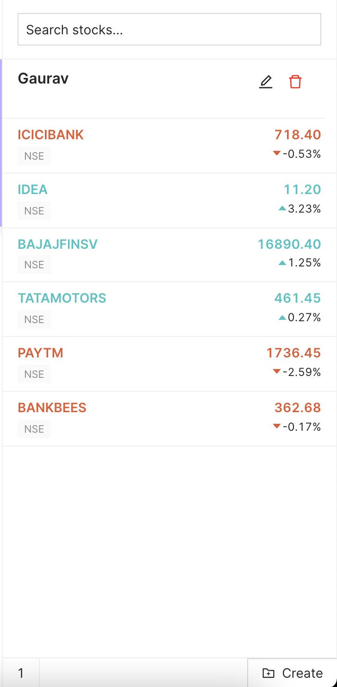
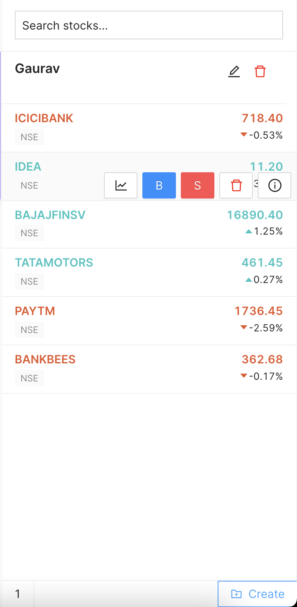
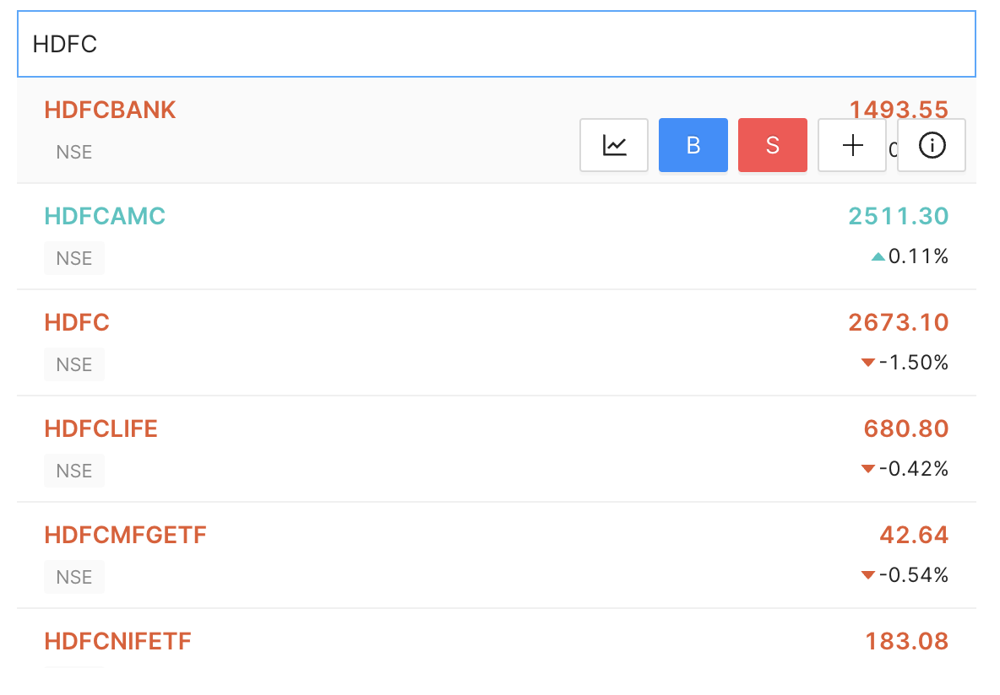

# TRINKERR INTERVIEW FRONTEND

## Background

If you are familiar to trading, you might have seen the watchlist feature. If not, then basically a watchlist is a place where you can see all your favourite stocks at one place and you can see the real time prices of it and execute the buy and sell actions on it.

## Objective

The objective of this assignment is to create a similar feature using the dummy data which will be provided to you.

## Reference Images

Create the watchlist structure as given in the below pic.

`Pic-1`



`Pic-2`



`Pic-3`


## Tasks to be done

1. On the Top of the Watchlist (see Pic-1 for reference), you can see a `Search Stocks` Options. You are given the data of the stocks in the `data.json` file in the repo. On Searching a stock, it should be drop down, where relevant search results are shown (see Pic-3 for reference).

2. Continuing with the First Task, on hovering the desired stock, A button should pop up (see Pic-3 for reference.). Instead of the 5 buttons, you just need to implement one button of Add.  

3. Continuing with the Second Task, on Clicking of Add button, the asset should be added to the watchlist. The asset should be displayed as shown in  pic-1. (For Reference, see data.json file). There are 3 fields for each asset. Example -

- ```jsx
  let data = [
    "ASIANPAINT::NSE",
    3143.65,
    3144.3
  ]
  ```
  The required fields to be shown in the watchlist will then be. ASIANPAINT, NSE, the current price which is `data[1]`, and the percentage change from yesterday which is
  
   `(data[1] - data[2]) / data[2])`
4. Continuing with the Third Task, on hovering the asset in the watchlist, the user should get the option of deleting it from the watchlist. (see Pic-2 for reference) 

5. Continuing with the Fourth Task, when a user is searching a stock, if the asset is already present, so instead of giving him the option of Add (Task-2) there should be a button of deletion.

6. The Final Task is to upload this project wherever you wish to do so. Be it S3, be it netlify, Heroku, Vercel wherever you feel like and provide the URL while submitting the final assignment. 

## Notes
1. The assignment will be evaluated on the basis of the tasks completed.

2. Any Extra Feature will fetch a brownie points. For example, like if the current price is greater than yesterday price, then the stock should be in green. if `data[1] - data[2] > 0`, show stock in green else red.

3. The project structure also matters. So keep a note of it. 

## Tech Stack
1. You need to implement the above using `React.Js` Library.

2. You are free to use any UI Library of your own choice.  

## Some Random Thoughts
1. If you are new to trading, it might feel a bit overwhelming for the first time, but this is how you can challenge yourself. Just remember, even the best programmer in the world started from `Hello World`. You will learn a lot while doing this.
